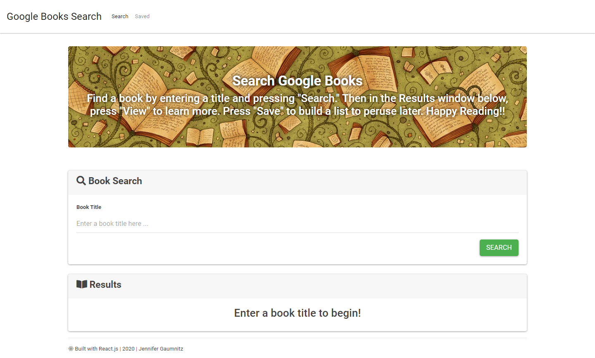
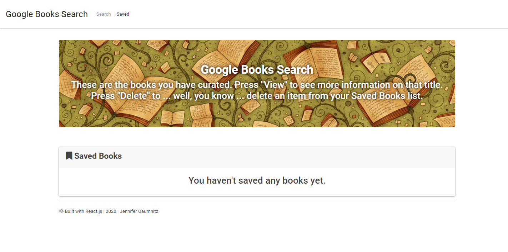
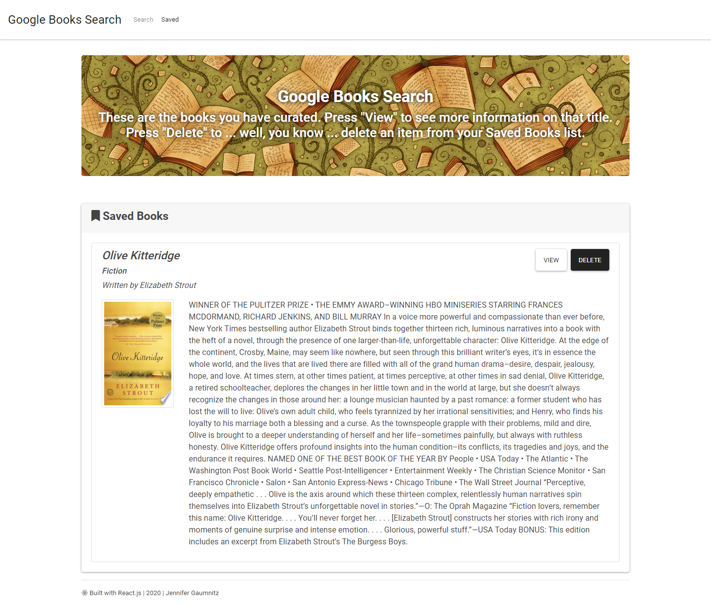

# React Google Book Search
A full-stack mobile-responsive Google Books Search app that displays books based on user input. This app uses Mongo, Express, React, and Node so that users can save books to review and perhaps purchase later.

created by Jennifer Gaumnitz
____________

Heroku deployed app: https://react-google-book-search-jlg.herokuapp.com/

GitHub repository: https://github.com/JLGaumnitz/google-book-search
- - - -

### How You Can Get Started With This Web App ###

<strong>To use the app:</strong> 

Simply go to the Heroku link above. 

In the book title field, enter a book title and press the "Search" button.

The Results field at the bottom of the page will be populated with books that match the search query term. Each result includes the book title, subtitle (if available), author, image (if available), and summary. Each book has a "View" and a "Save" button. "View" opens a new tab with a Google Books page about the book. 

"Save" adds the book to the Mongo database of the app.

By clicking on the Saved in the navbar at the top of the page, the app displays a list of books users have saved.

If there are no books saved yet, this page is displayed:

If there are books saved, they appear in the Saved Books field. The books in this list each have a "View" and a "Delete" button. As before, "View" opens a new tab with a Google Books page about the book. "Delete" removes the book from the Saved page.

The site is mobile responsive, styled with Bootstrap.

### Creating the app from my files in my GitHub repository ### 

To install and use this application yourself, clone the GitHub repository. 

You will need to have installed:

* Node
* And these dependencies: 
    * axios
    * express
    * mongoose
    * if-env

The frontend of the project was boostrapped with [Create React App](https://github.com/facebookincubator/create-react-app).

Once the code is in place if you cloned my repository, navigate to the root directory and run "npm install" in the command line. And then in the command line, type "npm start" or "yarn start" and navigate to localhost:3000 in your browser to see the app.

To deploy to Heroku, if you have made changes, you will need to create the build folder with "yarn build" and push the changes to your GitHub repository. You will also need to provision an mLab remote database, using the mLab MondoDB add-on in the Heroku dashboard. [This instructor video](https://youtu.be/qXIG8iKO7Fo) explains how to deploy a fullstack MERN project to Heroku using your GitHub repository. 

### Why the Project is Useful ###

  The app fulfills a homework assignment for University of Kansas Coding Boot Camp, August 2019 to February 2020. Besides allowing me to continue working with Node.js and npm packages, the assignment also allowed me to work with express, express-handlebars, and MySQL.

### Where Users Can Get Help with This Project ###

  Questions? Contact Jennifer Gaumnitz at jlgaumnitz@gmail.com

### Who Maintains and Contributes to the Project ###

  Jennifer Gaumnitz created the project. I probably will not update it again after completing this assignment. 
